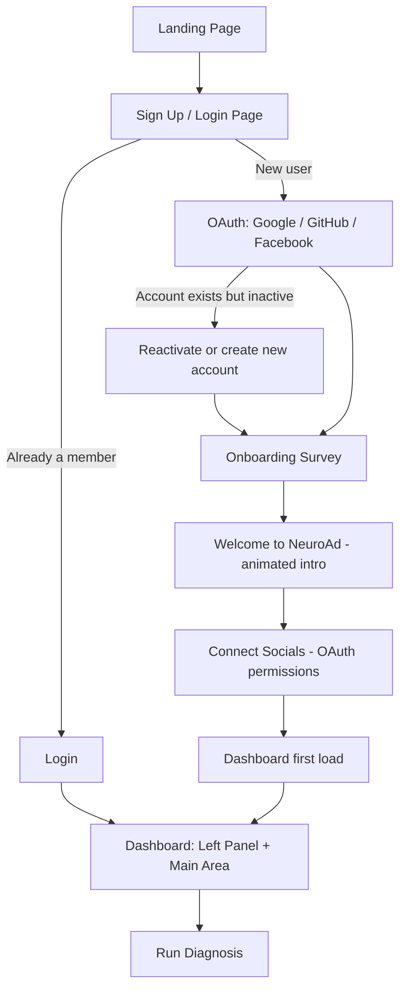

# NeuroAd: User Flow (Landing Page → Dashboard)

This flow adapts the onboarding pipeline observed on Apollo.io (sign-up page → onboarding form → home dashboard) to NeuroAd's own concept. Each stage lists what Apollo does (observed from the saved pages) and what NeuroAd should do.

---

## Flow Overview

---

## Stage 1: Landing Page

**Apollo (observed):** Marketing page with a value pitch, e.g. "Sign up for Apollo, free forever", and a link into sign-up. The visitor arrives from campaign links (UTM and partner tracking parameters are in the URL).

**NeuroAd:**
- Hero section with the value pitch (AI audit of your social campaigns, trend prediction, campaign testing).
- Primary CTA: **Get Started** → Sign Up page.
- Secondary CTA: **Login** (for returning users).
- Capture UTM / referral parameters and keep them through signup for attribution.

---

## Stage 2: Sign Up / Login Page

**Apollo (observed):**
- Headline plus a one-line value statement.
- Sign-up through **Google or Microsoft** ("Verify your business email").
- Agreement line: "By signing up, I agree to Terms of Service and Privacy Policy."
- "Already a member? **Login**" link.
- **Edge case:** if the email belongs to an inactive user, an inline message says to contact the admin to reactivate, or proceed to create a new free account.

**NeuroAd:**
- Sign-up options: **Google, GitHub, Facebook**.
- Terms of Service and Privacy Policy consent line.
- "Already a member? Login" link.
- Edge cases to handle:
  - Email already registered → send to Login.
  - Inactive or deactivated account → message to reactivate or create a new one.
  - OAuth denied or failed → return to the sign-up page with a clear error.

---

## Stage 3: Onboarding Survey

**Apollo (observed):** A short "Welcome to Apollo" form that shows which email you are signing up with and asks for:
- Full name
- Company name
- Company website (with a **"No company website"** escape option)
- Helper text: "This helps us personalize your workspace."

**NeuroAd:** Redirect here immediately after the first successful signup.

| Field | Required | Notes |
|---|---|---|
| Organization name | Yes | |
| Description of organization | Optional | Helps personalize insights |
| Website | Optional | Include a "No website" option like Apollo |
| LinkedIn / other socials | Optional | |
| Connector details (person or POC logging in) | Yes | Name, role, contact |

- Show the signed-in email at the top of the form.
- Add a short line explaining why you are asking (personalization).
- Only about 50% of fields need to be mandatory for now; the rest can be filled later from **Profile**.
- Skip the survey on later logins once it is completed.

---

## Stage 4: Welcome Page

**Apollo (observed):** No separate animated page; onboarding leads straight to the home screen.

**NeuroAd:**
- Animated "Welcome to NeuroAd" intro, kept short (3 to 5 seconds) with a **Skip** button.
- Ends with a single CTA: **Go to dashboard** (or **Connect your socials**).

---

## Stage 5: Connect Socials (recommended addition)

Not in the original notes, but required before Run Diagnosis can work.

- Prompt to connect Instagram, Facebook (via Meta Graph API), and other platforms.
- Clearly explain which permissions are requested and why.
- Allow **Skip for now**; the dashboard shows an empty state prompting the connection.

---

## Stage 6: Dashboard (First Load)

**Apollo (observed):**
- Left sidebar navigation (Home, AI Assistant, People, Companies, Sequences, Analytics, etc.).
- Home shows a **"Get started" checklist** with three tasks, tied to a 14-day window and credit rewards.
- An **Onboarding hub** progress indicator ("0% Completed").
- **AI Assistant** entry ("Pick up where you left off") and AI suggestion shortcuts.
- Resource cards at the bottom: Academy, webinars, help docs.

**NeuroAd:**

### Left panel
- Recently completed campaigns
- Trend analysis and trend prediction
- Campaign history
- Socials (Instagram, Facebook, etc.)
- Profile
- Campaign calendar
- Campaign tester
- **Foxy**, the chatbot assistant

### Main area (first load)
- **Getting started checklist** (borrowed from Apollo's pattern):
  1. Complete your profile
  2. Connect at least one social account
  3. Run your first diagnosis
- **Onboarding progress bar** (e.g. 0% → 100%).
- Primary CTA: **Run Diagnosis**.
- Foxy suggestion chips (equivalent of Apollo's "AI suggestions"), such as "Analyze my last campaign" or "What is trending in my industry?"
- Help and resources card.

---

## Stage 7: Core Action: Run Diagnosis

1. User clicks **Run Diagnosis**.
2. AI agents scan all connected socials and pull the latest comments.
3. Meta Graph API supplies API-level analysis.
4. Output: graphs of performance, sentiment from comments, and an evaluation of the organization's campaigns.

---

## Summary Comparison

| Stage | Apollo | NeuroAd |
|---|---|---|
| Entry | Landing → Sign-up | Landing → Sign-up |
| Auth | Google / Microsoft | Google / GitHub / Facebook |
| Onboarding | Name, company, website | Org name, description, links, connector details |
| Post-onboarding | Straight to Home | Animated welcome → connect socials → Dashboard |
| Dashboard hook | Checklist + credits + AI Assistant | Checklist + Run Diagnosis + Foxy |
| Edge cases | Inactive user, existing member | Same, plus OAuth failure and skipped socials |

---

## Open Questions

- Which social platforms beyond Meta are in scope for launch (X, LinkedIn, YouTube)?
- Is there a team or multi-user model (several people per organization), or one login per organization?
- Does a free tier exist, and does the checklist reward users (like Apollo's credits)?
- How is the login identity (Google/GitHub/Facebook) linked to the social accounts being analyzed?
